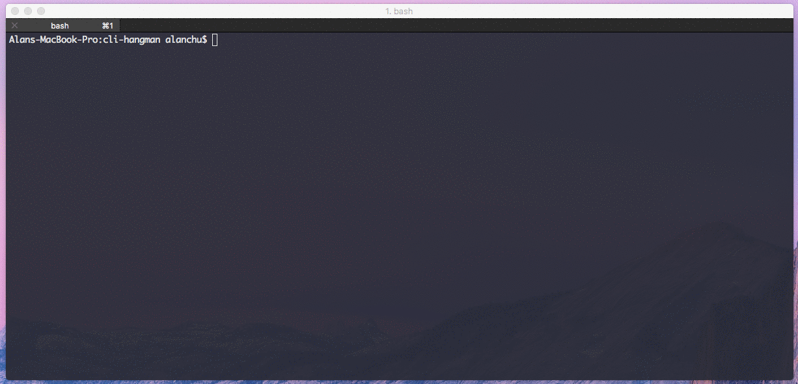

# command-line-hangman
> a node.js REPL game of hangman

This little command line hangman game uses a random
quote generating API to get a random quote and the associated
author of that quote. You'll get to guess the author in a few
guesses as possible. Enjoy!

## Demo


## Usage
 *You must make sure that you have your an API key to the mashApe random quote API.
 If you don't have one you can contact me.

```
$ npm install
$ npm start YOUR_API_KEY
```


## Features
- mashApe API for random quote generator

## NPM packages
- inquirer
- figlet
- clear
- chalk

## Issues
- ~~allows for authors with "periods" in the name~~
- check that authors are valid letters a-z
- add validator to inquirer